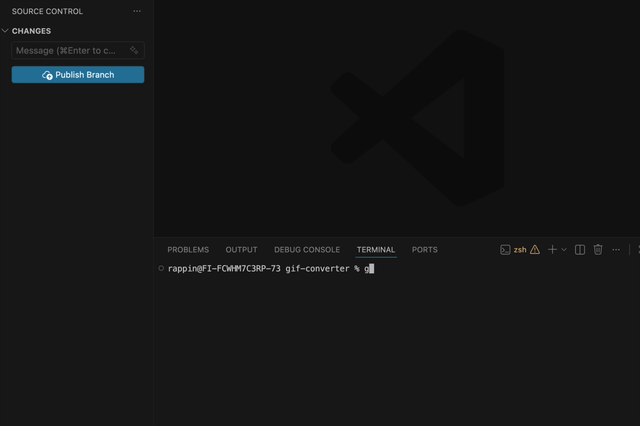

# gifzap

Small CLI utility for turning a short video into a GIF that works well in GitHub repos, pull requests, and docs.



## Requirements

- [ffmpeg](https://ffmpeg.org/) installed and available on your `PATH`
- Node.js 18+

## Usage

Run it directly with Node:

```bash
node ./bin/gifzap.js
```

Or install it locally for command-style usage:

```bash
npm install
npm link
gifzap
```

After `npm link`, `gifzap` is available as a command in any repo on your machine. It always uses the repo you run it from as the primary working directory, so running it inside a different repo will make that repo the primary place it looks for videos, where it writes the generated GIF, and which `README.md` it updates.

With no input, `gifzap` looks for the first `.mp4` or `.mov` it can find in this order:

- the current repo directory, recursively
- your macOS Screenshot app save location, if one is configured

You can add your own screenshots directory with `--screenshots-dir <path>` or by setting `SCREENSHOTS_DIR`.

When it auto-detects a video, it writes the GIF into your current working directory as `demo.gif`. If that already exists, it uses `demo-2.gif`, `demo-3.gif`, and so on. With `--replace`, it updates the most recent existing `demo*.gif` instead. It also inserts a Markdown image reference right below the title in `README.md` in that repo if one exists. If you pass an explicit input file, it creates `<input>.gif` next to that source video unless you provide an output path.

## Options

```bash
gifzap [input] [output] [options]
```

- `--fps <number>`: frame rate for the GIF, default `10`
- `--width <pixels>`: output width, default `640`
- `--speed <number>`: playback speed multiplier, default `1`
- `--start <time>`: start from a specific timestamp
- `--duration <time>`: only convert part of the video
- `--screenshots-dir <path>`: extra folder to search when auto-detecting
- `--replace`: replace the latest `demo*.gif` in the repo
- `--overwrite`: replace the output file if it already exists

## Examples

Convert the first matching recording from the repo or screenshots folder:

```bash
gifzap
```

That will create the GIF in the repo you are currently in and attach it just below the title in that repo's `README.md` when present.

Use your screenshots folder explicitly:

```bash
gifzap --screenshots-dir "/Users/your-name/Library/CloudStorage/OneDrive-Company/Screenshots"
```

Set it once in your shell:

```bash
export SCREENSHOTS_DIR="/Users/your-name/Library/CloudStorage/OneDrive-Company/Screenshots"
gifzap
```

Convert a short demo video:

```bash
gifzap demo.mp4
```

Speed up a long demo to make the GIF shorter:

```bash
gifzap --speed 2 --width 720 --fps 12
```

Replace the latest generated demo GIF instead of creating `demo-2.gif`:

```bash
gifzap --replace
```

Create a smaller GIF for a README:

```bash
gifzap demo.mp4 assets/demo.gif --width 560 --fps 8
```

Trim a short moment out of a recording:

```bash
gifzap demo.mp4 preview.gif --start 00:00:02 --duration 3
```

## Tips for GitHub repos

- Keep clips short, usually `2` to `6` seconds
- The defaults are `--width 640` and `--fps 10`
- Use `--width 560` for smaller files or `--width 720` for sharper UI demos
- Lower `--fps` to `8` if the GIF gets too large
- Use `--speed 1.5` or `--speed 2` to make long recordings easier to scan
- Use `--replace` when you want to keep reusing the same README GIF path
- Start from a trimmed source clip when possible for the best results

